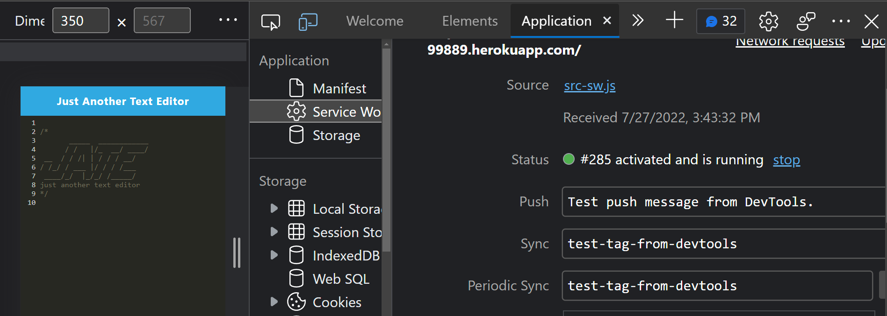
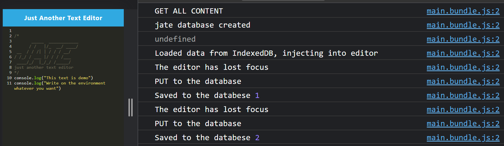
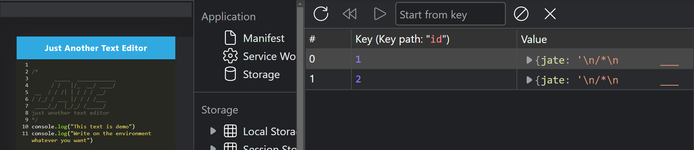

# PWA-text-editor

This is a PWA (Progressive Web Apllication) text editor application that runs in a browser as a single page. The application utilizes Service Worker and Cache API to update assets and enables an effetive offline experiences, as well as traffic network requests. This apllication will also utilizing npm package 'idb' that lightly wraps around the IndexedDB API. Another module caled 'webpack' is used to bundle JavaScript file for browser usage and support different front-end assests.

## URLs

Github Repo: https://github.com/binnie51/PWA-text-editor.git   
Heroku deployed: https://desolate-beach-99889.herokuapp.com/

## Technologies

* HTML
* CSS
* JavaScript
* Service Worker
* Cache API
* Node.js
* Express.js 
* npm:
  * webpack
  * idb
  * babel
* Webpack plugins:
  * html-webpack-plugin
  * webpack-pwa-manifest
  * workbox-webpack-plugin

## Usage

Go to the [deployed link](https://desolate-beach-99889.herokuapp.com) and start typing on the editor enviroment. Click on the 'Instal!' button to have it run as a PWA. You may detect the presence of service worker by opening up the dev tool and clear up Storage under Application, refresh the page, and click on Service Worker to see if it updated on the current time.  

## Screenshots
### Presence of service worker

### Console updating 

### IndexedDB storage reflects upon the number of entries

## Contribution
DO NOT CONTRIBUTE!

## License
  
Copyright (c) Vincent Tjia. All rights reserved.
